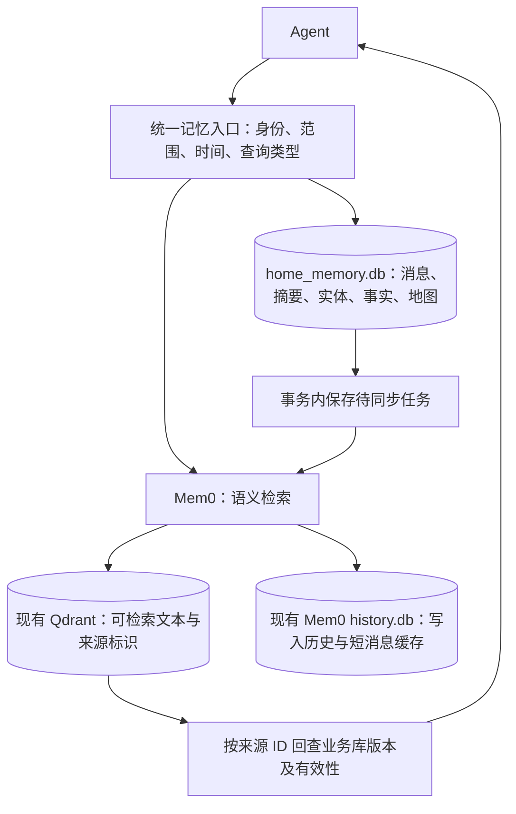

# 家庭 Agent 的三类记忆设计

日期：2026-09-17。基于 `speech-volcengine:/Knowin/foundation/seb/mem0-main` 的当前源码与数据库核对。

这是设计方案；本次没有创建家庭数据库、改写已有记忆或启动后台总结任务。

## 1. 三个业务模块，一个记忆入口

| 模块 | 负责内容 | 持久化原始依据 | 读取方式 |
| --- | --- | --- | --- |
| 资料知识 | 预先导入的说明书、公开资料、图片解析结果 | 原件、文档版本、分页片段 | 语义检索，带来源和版本 |
| 对话记忆 | 完整消息、近期上下文、会话摘要、历史事件 | 按会话追加的原始消息；可追溯摘要 | 最近消息按顺序读；旧事件按需检索 |
| 家庭信息 | 成员、物品、房间、归属、偏好、位置、地图 | 有主键、有版本的事实和观测记录 | 结构化查询当前状态；语义索引用于找实体和相关描述 |

“预先存入”是来源，“家庭信息”是数据内容，它们不是互斥分类。预置的家庭 JSON 应进入家庭模块；聊天里确认的物品归属同样进入家庭模块，只是来源不同。不要分别维护一份“聊天里的杯子位置”和一份“地图里的杯子位置”，让它们各自成为当前事实。

第一、第三模块可以合并成 Agent 看到的“长期知识”入口，也可以共用现有 Qdrant 集合。同一向量空间中的记录必须使用兼容的 embedding 模型、版本和维度；维度相同并不意味着两个模型的向量可以混搜。

建议保留不同的数据规则：文档保存“这份资料写了什么”；家庭状态保存“当前采信什么，以及依据是什么”。坐标、归属、版本判断以业务数据库为准。Mem0 的实体索引是辅助检索结构，不是家庭成员关系表，也不是导航地图。



首次接入时，已有 180 条资料记录可继续使用；为它们登记来源和版本映射即可，不必仅为调整分类重新调用视觉模型。

## 2. 当前到底有几个数据库

当前有效数据目录中有 **3 个数据库文件，属于 2 套存储职责**。以下路径以 `/Knowin/foundation/seb/mem0-main` 为根目录，不计备份。

| 当前文件 | 内容 | 此次只读检查 |
| --- | --- | --- |
| `.data/qdrant/collection/mem0_7a008ae9dff3/storage.sqlite` | Qdrant 主集合内部存储 | 182 个 point，包括已导入资料和原有记录 |
| `.data/qdrant/collection/mem0_7a008ae9dff3_entities/storage.sqlite` | Qdrant 实体检索集合内部存储 | 0 个 point；不是家庭业务表 |
| `.data/mem0_7a008ae9dff3_history.db` | `history` 与 `messages` 表 | history 182 行、messages 2 行 |

前两个 SQLite 文件由 Qdrant 管理；应用不应直接改其 BLOB。`history.memory_id` 对应主集合中的记忆 ID；实体集合的 `linked_memory_ids` 可指向多条记忆。这些跨文件关联由代码维护，没有跨数据库外键。

当前 `messages` 表按 scope 只保留最近 10 条消息，不能承担完整聊天归档；`history` 记录记忆写入/更新/删除，也不等于完整对话记录。

建议仅新增一个 `.data/home_memory.db`，统一放家庭业务数据、完整会话与摘要。落地后为 **1 套 Qdrant + 2 个独立 SQLite 库**；若现有集合数量不变，则是 4 个主要数据库文件，不计 WAL/SHM、备份及未来新增集合。

这个规模先不新增 Redis、Neo4j 或独立地图数据库。多进程和多设备部署时，可把业务 SQLite 迁为 PostgreSQL，把本地 Qdrant 改为服务模式；当前本地 Qdrant 不适合多个独立进程同时打开同一路径。

## 3. 业务表与 ID 关系

下面是建议的逻辑表，不是已经建好的表。

| 表 | 关键字段/关联 | 作用 |
| --- | --- | --- |
| `households` | `household_id` | 家庭边界 |
| `entities` | `entity_id`, `household_id`, `entity_type` | 成员、物品、房间统一稳定 ID；名字和昵称只是属性 |
| `entity_aliases` | `entity_id`, `alias`, `context` | “妈妈”“我的杯子”等表达的候选映射，不凭同名直接合并 |
| `maps` | `map_id`, `version`, `household_id`, `frame_id`, `asset_uri` | 地图版本、坐标系和原地图文件 |
| `conversations` | `conversation_id`, `household_id`, `visibility` | 会话和访问范围 |
| `messages` | `message_id`, `conversation_id`, `seq`, `speaker_id`, `role`, `event_at`, `content` | 完整原始消息，按 `seq` 排序；重复请求用消息 ID 去重 |
| `conversation_summaries` | `summary_id`, `conversation_id`, `through_seq`, `source_range`, `text` | 摘要覆盖到哪里，能回查原文；不覆盖全部原始消息 |
| `documents` | `document_version_id`, `doc_id`, `source_sha256`, `scope`, `path` | 一个逻辑文档可有多个版本 |
| `document_chunks` | `chunk_id`, `document_version_id`, `page_start`, `page_end`, `text` | 可引用的原始资料片段 |
| `observations` | `observation_id`, `entity_id`, `observed_at`, `received_at`, `source`, `value_json` | 摄像头、定位、用户报告等观测记录，追加保存 |
| `fact_versions` | `version_id`, `fact_key`, `subject_id`, `predicate`, `object_id/value_json`, `status`, 时间字段 | 采信的事实及历史版本；归属、房间、偏好都可表达 |
| `fact_evidence` | `version_id`, 消息/片段/观测的来源 ID | 一个事实关联多份证据；重复摘要不算独立证据 |
| `vector_links` | `source_kind`, `source_id`, `source_version`, `collection`, `memory_id` | 业务记录与 Mem0 向量记录的映射；一条业务记录可对应多个片段 |
| `index_outbox` | `event_id`, `source_id`, `source_version`, `operation`, `status` | 可靠同步向量的待办任务 |

核心关系是：家庭拥有多个实体和会话；会话拥有多条消息；消息、文档片段和观测为事实提供证据；事实通过 `subject_id/object_id` 连接人物、物品、房间；向量只保存可检索的文本和反查 ID。

例如 `cup_01 --owned_by--> member_02` 与 `cup_01 --last_seen_in--> room_03` 是两条不同关系；物品所有者、通常收纳处、最近观测位置应使用不同 predicate，不能共用“位置”或“归属”字段。

一次业务写入在同一 SQLite 事务内保存事实新版本、旧版本状态和 `index_outbox` 任务。事务提交后同步 Mem0；失败重试时先核对 `source_id + source_version + chunk_id` 是否已有向量，不能只凭报告判断成功。并发处理需要任务租约/单写入者与版本校验，避免崩溃重试制造重复。

SQLite 与 Qdrant 之间没有原子事务。查询当前状态时应回查 SQL 中的事实版本；向量同步滞后时不能把旧坐标直接交给机器人。业务记录的向量索引可由原始事实/片段重建，Mem0 history 只是补充审计，不能替代业务版本和证据记录。

## 4. 地图与坐标 JSON

JSON 适合表示结构化信息，但必须保留坐标系、单位、地图版本、来源和时间。下面只是示例数据，不代表实际家庭状态。

```json
{
  "observation_id": "obs_102",
  "household_id": "home_001",
  "entity_id": "cup_01",
  "predicate": "last_seen_pose",
  "room_id": "room_living",
  "pose": {
    "map_id": "home_map",
    "map_version": 3,
    "frame_id": "map",
    "floor_id": "floor_1",
    "units": "m",
    "x": 2.4,
    "y": 1.2,
    "z": 0.75
  },
  "observed_at": "2026-09-17T10:30:00+08:00",
  "received_at": "2026-09-17T10:30:02+08:00",
  "source": {"kind": "vision", "device_id": "robot_01", "frame_id": "camera_frame_887"},
  "confidence": 0.93
}
```

可生成文本索引：“杯子 cup_01 于 10:30 在客厅茶几上被观察到”，并附 `entity_id`、`observation_id`。问“我的杯子在哪”时，先解析“我”和具体杯子，再读最近可靠观测；问“距离机器人最近的杯子”时，用统一坐标系计算距离。

不要用文本 embedding 距离替代空间距离。不同地图版本的坐标需要有效变换，不能直接比较。地图大文件、点云、占据栅格保留在导航系统/文件存储，业务库记录引用和版本；高频位姿流无需逐帧送入 LLM 或 Mem0。只在对象稳定出现、移动、丢失等事件发生时更新记忆。

观测位置不是永久实时位置。过期后只能回答“最后一次在某时观察到”，必要时重新感知；机器人执行前还要向当前感知/导航系统核对目标状态。

## 5. 对话如何变成长期记忆

分别维护三种产物：原始消息、用于继续聊天的滚动摘要、可跨会话使用的事实/事件。落盘只代表保存；是否是长期记忆，由内容、范围和生命周期决定。

1. 收到消息先持久化：保留发送者、角色、会话、消息 ID、发生时间与顺序，再开始回复。
2. 组装本轮上下文：最近消息 + 旧消息摘要 + 按需召回的资料/长期事实 + 当前家庭状态；不把全部记忆每轮塞入模型。
3. 创建总结/抽取任务：建议初始策略为累计约 20 条新消息、接近上下文预算或会话结束时总结；这些是可配置起点。“请记住”“更正一下”和状态变化立即进入事实处理。
4. 从未处理的原始消息窗口并行生成两类候选：会话摘要，以及逐条事实/事件。解析人称、时间、否定、条件和归属，不能把 assistant 的推测、引用、假设当成用户确认。
5. 核验实体、范围、事实类型、来源和有效时间。抽取模型的“置信度”只作信号，不能当作事实正确率。
6. 与已有事实按实体及属性比较：相同则追加证据；明确变化则形成新版本；冲突未决则保留候选，暂不变更当前状态。
7. 在业务事务中保存摘要覆盖范围、候选/接受事实和处理进度；失败按窗口及消息 ID 重试。索引待办随后调用 Mem0，将已核验事实以 `infer=False` 写入并保留出处。
8. 后续会话按家庭、成员、权限及时间召回；无需回放所有聊天才知道有效偏好。

例如“我一直不吃香菜”可成为个人长期偏好；“我今天不想吃香菜”只是当天状态；“明天提醒我买奶”还需要任务/提醒系统，存为记忆不会自动触发提醒；“可能把钥匙放沙发了”应保留不确定性。

摘要不能取代原始证据，不能靠多次总结把一句猜测升级为事实。后续摘要应结合对应原始消息窗口；重新总结的时间不能刷新原事实的观测时间。

跨会话长期记忆不要默认用每次变化的 `run_id` 限定检索；会话标识可留在 metadata 中作为来源。家庭共享、成员私有与公共资料分别建立授权范围，在业务入口统一校验。

## 6. 时间、版本与矛盾

| 字段 | 语义 |
| --- | --- |
| `observed_at` / `event_at` | 实际观察或事件发生时间；无法确定时保留未知，不编造 |
| `recorded_at` | 系统收到/保存这条依据的时间，用于识别迟到数据 |
| `valid_from`, `valid_to` | 某个被采信事实的业务有效区间；上界未知时为空 |
| `expires_at` | 超过多久不能继续作为当前状态使用；过期不必删除历史 |
| `status` | 如 candidate、active、superseded、disputed、retracted |
| `version`, `supersedes_id` | 版本以及替代关系 |
| `source`, `evidence_ids` | 来源和可回查证据 |

内部统一保存 UTC 的带时区时间，按家庭时区展示；“今天/明天”依据原消息时间与时区解析。Mem0 的 `created_at/updated_at` 是写入维护时间，不能代替业务发生时间。

处理冲突前先检查：是不是同一实体、同一属性、同一上下文、重叠有效时间，以及这个属性是否只能有一个值。喜欢咖啡和喜欢茶通常不冲突；同一杯子同一时间在两个房间才可能冲突。

| 情形 | 处理 |
| --- | --- |
| 同一事实重复出现 | 合并来源/证据，保留原始时间；不重复创建当前事实 |
| 偏好真实改变，例如“以后喝燕麦奶” | 新版本生效，旧版本成为历史；旧偏好在过去可能仍正确 |
| 明确纠错，例如“刚才说错了，这不是小明的杯子” | 撤回错误断言，建立纠正记录；不能简单当成所有权刚刚转移 |
| 物品从客厅移动到卧室 | 追加观测，更新当前估计；只看到两个位置时不能伪造精确移动时刻 |
| 旧观测晚到 | 按观测时间记录历史，不因刚入库就覆盖较新观测 |
| 同一时刻传感器与口述冲突 | 按属性和来源可靠性仲裁；不能判断则标 disputed，并重新感知或向当事人确认 |
| 两份资料描述不同版本的产品 | 保留各自来源/发布日期/产品版本，按查询时间与版本选取 |
| 地图重新建图 | 旧坐标保留原地图版本，变换或重新定位后再用于当前操作 |

不要采用统一的“最后写入者获胜”。个人偏好通常本人明确纠正最有权威；精确当前位置通常需要最新可靠感知；新下载的旧手册不能覆盖新版本资料。来源优先级应按字段定义。

对房间结构和确认的归属可设置较长有效期；对人员位置、可移动物品位置采用更严格的新鲜度策略。有效期应由业务场景配置，不能对全部记忆使用同一个天数。

已被替代或有争议的记录仍可服务“以前在哪里/为什么这样认为”的查询，但默认当前状态查询须排除。不能仅在 metadata 写 `status=active` 就期待所有检索自动执行过滤。

## 7. 访问范围与查询组合

建议 metadata 至少含 `memory_kind`（document/fact/episode）、`origin`（import/chat/vision/manual）、`scope`、`household_id`、`subject_id`、`source_id`、`source_version` 和状态/时间。

公共资料、家庭共享信息、成员个人信息可以共用集合，但必须由可信后端根据真实用户身份决定可读写范围。`user_id` 或 `household_id` 参数本身不是授权；用户说“我是爸爸”也不能自动获得另一个成员的权限。

已有公共资料的 `user_id=knowin_public` 可以保留。家庭共享与私有记忆采用独立范围标识；统一入口分别查询已授权的公共资料、当前家庭共享信息和当前成员私有记忆，再合并结果。不要把三个不相容的 `user_id` 同时做 AND 过滤，也不要为了查全而省略全部范围过滤。

具体路由示例：

- “X1 最大负载是多少”：查资料片段，并显示文件与页码。
- “我的杯子在哪里”：解析当前说话者 → 查杯子归属 → 查最近有效位置 → 返回时间与来源。
- “我上次为什么换了杯子”：查有授权的会话事件 → 回查原消息。
- “把妈妈的杯子拿过来”：结合人物/物品关系、近期状态与机器人当前感知；执行结果写成新的观测事件。

## 8. 当前代码具备什么，还缺什么

已核实的源码位置：

- `mem0/memory/main.py:879`：`infer=False` 逐条写入文本。
- `mem0/memory/main.py:920`：抽取时读取最近 10 条消息。
- `mem0/memory/main.py:942`、`:1064`：普通抽取使用 additive prompt，产出的历史事件为 ADD；不能把自动冲突替换当作现有能力。
- `mem0/memory/main.py:1815`：有显式 `update(memory_id, text=..., metadata=...)`。
- `mem0/memory/main.py:2080`：显式更新记录 old/new 历史，但业务有效期、完整证据链仍需业务层保存。
- `mem0/memory/main.py:427`：现有 `expiration_date` 是日期；不能替代按秒控制的动态位置新鲜度。
- `mem0/memory/storage.py:257`：保存上下文后删除同范围超过 10 条的旧消息。
- `local_runtime/runtime.py:121`：当前 Qdrant 目录与 history SQLite 配置。
- `local_runtime/materials.py:446`：现有资料检索入口只处理资料范围，尚未实现这里提出的家庭权限、事实版本及有效时间回查。

建议实施顺序：先建业务库与完整消息记录；再实现实体/位置查询和时间版本规则；然后接入摘要、事实抽取与可恢复索引同步；最后把三路查询接入 Agent。测试应重点覆盖迟到观测、同名成员、共享/私有隔离、矛盾纠正、过期位置与索引同步失败。

总结/事实抽取可复用现有 `qwen-plus`，向量继续使用 `text-embedding-v4`，图片仍用已有 `qwen-vl-plus`。不因分成三个业务模块就必须增加模型或 API Key。

参考资料：[Qdrant 多租户过滤](https://qdrant.tech/documentation/guides/multitenancy/)、[Qdrant JSON payload](https://qdrant.tech/documentation/manage-data/payload/)、[Mem0 显式更新接口](https://docs.mem0.ai/core-concepts/memory-operations/update)。这里的家庭版本库、权限路由和总结任务是拟议应用设计，不是这些组件自动提供的整套功能。
